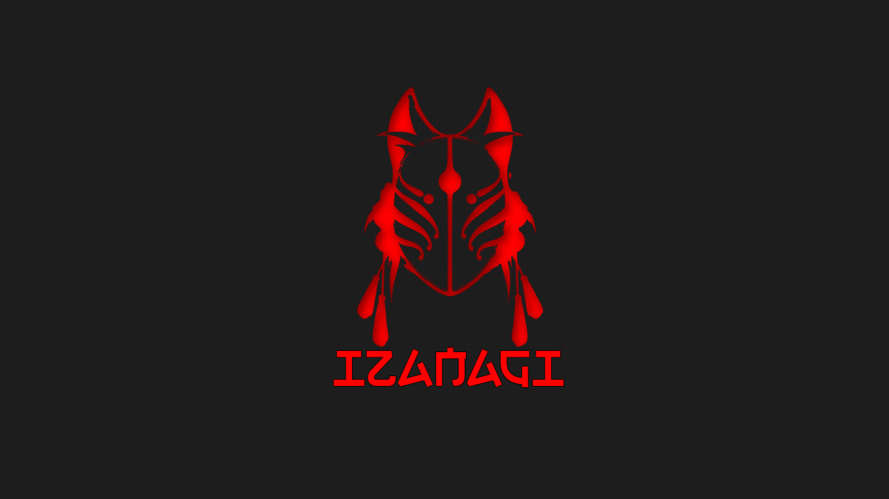

# Izanagi





## TL;DR: 


- Izanagi uses Zero-Knowledge Proofs and Machine Learning to certify smart contract security without exposing source code, targeting developers who prioritize both privacy and integrity.
- Our **Goal** is to : use zkML to prove the absence of vulnerabilities in (closed-) source code. Izanagi leverages zkML (Zero-Knowledge Machine Learning) to prove the absence of vulnerabilities in (closed-) source code, particularly focusing on smart contracts within the decentralized finance (DeFi) ecosystem.

## Storytelling : User Experience 


Imagine you've poured countless hours into crafting the perfect smart contract, only to face the daunting task of proving its safety without revealing your confidential source code.

Enter Izanagi! With Izanagi, developers can now confidently showcase the integrity of their contracts without compromising their code's confidentiality. Through Zero-Knowledge Proofs and Machine Learning, Izanagi empowers you to demonstrate your contract's reliability while keeping your code private. Say goodbye to sleepless nights worrying about rug pulls or vulnerabilities – Izanagi has got your back, ensuring your creations are as trustworthy as they are confidential.


# Instructions:

1. Add 
```
NEXT_PUBLIC_OPENAI_API_KEY=sk-...
```

to frontend/packages/nextjs/.env.local

2. 

```
cd frontend
yarn
yarn chain
yarn deploy
yarn start
```

# Ideal Path Conversation:
```
- user: i want to verify that a contract is not vulnerable but i don't have the source code
- bot: that's fine, send me the bytecode
- user: here's the bytecode
- system: call oracle function with bytecode and receives JSON object response
- system: call sindri function with oracle JSON output and receive zk Proof
- bot: here is the zk proof that it's safe
- user: cool, i'd like to verify this
- system: call blockchain function with zkProof to contract on Morph and receive true or false
- bot: yes it's verified that the proof is correct that there's no vulnerability in the code
```

